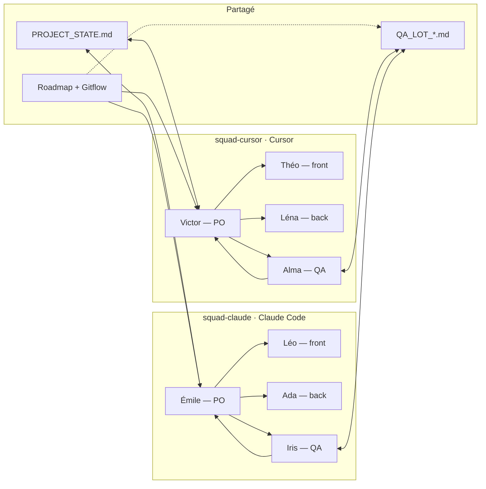

# Architecture des agents — Yeboekun / Yeboekun

> Schéma de coordination des agents IA et humains sur le projet.
> Source partagée Cursor ↔ Claude Code via `docs/PROJECT_STATE.md`.

## Schéma

## Principes

**Les POs sont les seuls à toucher la doc partagée.** Victor (Cursor) et Émile (Claude Code) sont les uniques agents qui lisent et écrivent dans `PROJECT_STATE.md`. Les spécialistes (Théo/Léna/Alma, Léo/Ada/Iris) reçoivent des briefs filtrés par leur PO et ne consomment pas le contexte global directement. C'est l'application de la règle "lis-une-fois-résume-pour-tous".

**STATE.md est le seul pont entre les deux IDEs.** Aucune arête directe entre Victor et Émile : ils ne se "parlent" pas. Quand le PO humain bascule de Claude Code à Cursor (ou inverse), le nouveau PO lit STATE et reprend sans demander de contexte.

**QA détient ses checklists.** Iris et Alma maintiennent les fichiers `QA_LOT_*.md` (read/write). Leurs verdicts remontent à leur PO (`A → V`, `I → E`), qui les consigne dans STATE.

**La Roadmap pilote les checklists QA.** Dépendance documentaire en pointillés (`ROAD -.-> QA_DOC`) : les checklists QA dérivent des lots de la roadmap. Quand un lot est ajouté ou modifié, la checklist correspondante doit suivre.

## Casting

| Rôle | squad-claude (Claude Code) | squad-cursor (Cursor) |
|---|---|---|
| PO orchestrateur (entry point) | **Émile** | **Victor** |
| Frontend (React 19 + TS + MUI 7) | **Léo** | **Théo** |
| Backend (.NET 9 + EF Core + MySQL) | **Ada** | **Léna** |
| QA challenger / release | **Iris** | **Alma** |

Les prénoms permettent de tracer l'origine d'une décision dans l'historique : "Léo a tranché X" = squad-claude, "Théo a tranché X" = squad-cursor.

## Composition des squads (GitHub Teams)

Les deux squads existent comme `GitHub Teams` dans l'organisation et sont les destinataires des reviews automatiques (`.github/workflows/auto-assign-reviewers.yml`). Les agents IA donnent leur nom à la squad pour la lisibilité, mais derrière chaque squad il y a des **humains** qui valident les PRs et posent le label `qa-validated`.

### `@org/squad-claude`
Membres IA : Émile, Léo, Ada, Iris.
Membres humains : à compléter par le PO humain selon ton équipe.
**Reviewer par défaut** des PRs sur lots **pairs** (Lot 2 Rivière, Lot 4 Atelier, etc.).

### `@org/squad-cursor`
Membres IA : Victor, Théo, Léna, Alma.
Membres humains : à compléter par le PO humain selon ton équipe.
**Reviewer par défaut** des PRs sur lots **impairs** (Lot 1 Foundation, Lot 3 Contemplation, Lot 5 Tableau).

Le rationnel de l'alternance : sur chaque lot, le code est *produit* par une squad et *revu* par l'autre. Aucune squad ne mergera jamais son propre code sans regard externe.

## Gates CI/CD (alignés sur le schéma)

Les workflows GitHub Actions appliquent les invariants du schéma au merge :

- `ci.yml` — build + tests frontend et backend (verrou de base).
- `docker-build.yml` — compose build + smoke tests API/front (`push` sur `main` / `develop`, `pull_request` vers `main` — voir le fichier).
- `pr-checklist.yml` — la PR doit avoir ses cases obligatoires cochées (PO test navigateur OK, non-régression Arbre OK, etc.).
- `require-qa-label.yml` — le label `qa-validated` doit être présent. Posé par Alma ou Iris après leur passage.
- `auto-assign-reviewers.yml` — alternance des reviews humaines : lots impairs → squad-cursor, lots pairs → squad-claude. *(Peut être désactivé côté dépôt — ex. fichier `.disabled` tant qu’il n’y a pas d’org GitHub.)*
- `perf-gates.yml` — bundle size gzip et scores Lighthouse vs `BASELINE.md` (seuils contractuels du lot courant).

Les agents IA peuvent faire une *première passe* de review (à organiser via une action complémentaire optionnelle), mais le merge requiert la validation humaine de la squad opposée.

**Sécurité / accès produit** : le garde-fou *accès famille* (mot de passe partagé + cookie API) est documenté dans [`docs/architecture/FAMILY_ACCESS.md`](FAMILY_ACCESS.md) — hors périmètre « agents », mais pertinent pour Ada/Léna au backend et Léo/Théo au front.

## Évolution

Quand un nouvel agent ou un nouveau pôle est ajouté (par exemple un agent designer ou data scientist), il faut :

1. Mettre à jour ce schéma (`docs/architecture/AGENTS_SCHEMA.md`).
2. Définir sa spec dans `docs/agents/`.
3. L'enregistrer dans STATE.md avec ses responsabilités.
4. Adapter les workflows CI s'il a un rôle de gating.

